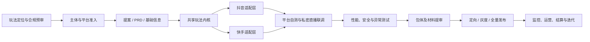

# 弹幕小玩法开发与发布：资料索引

## 资料边界

本专题服务于“和朋友开发、发布抖音与快手弹幕小玩法”的个人项目，和本职工作的游戏发行、广告投放资料分开维护。

- 存放位置：`40_资料库/个人项目/弹幕小玩法平台开发`
- 当前范围：准入、产品设计、技术接入、联调测试、提审发布、线上运维、结算与合规
- 来源原则：只把两平台官方域名正文作为已核实事实；不把第三方教程和站内外链页面自动视为官方结论
- 使用原则：本文是 2026-07-16 的规则快照；提案、提审、上线和结算前必须回到官方页面与开发者后台复核

## 从这里开始

| 要解决的问题 | 优先读取 |
|---|---|
| 先看整个项目怎么做、哪些能共用 | [[抖音快手弹幕小玩法-双平台差异与共用工程清单]] |
| 做抖音提案、开发、测试或提审 | [[抖音直播小玩法-全流程开发与发布指南]] |
| 做快手入驻、PC 客户端、联调或上线 | [[快手弹幕小玩法-全流程开发与发布指南]] |
| 发布前快速验收 | 双平台清单中的“发布闸门”，再回到对应平台指南 |

## 一句话结论

双平台最稳妥的做法不是维护两套完整玩法，也不是在一套代码里到处写平台判断，而是：

> 共用玩法内核、状态机、渲染、事件标准模型和可靠性设施；分开实现主播启动、鉴权签名、事件接入、礼物/指令配置、客户端包体、测试、审核和发布流程。

## 全流程总览



## 证据强度

| 标记 | 含义 | 使用方式 |
|---|---|---|
| 已核实 | 两个平台官方域名正文可直接支持 | 可用于方案和检查清单，但仍需关注更新时间 |
| 动态规则 | 官方正文可支持，但数值、名单或权限会变 | 只作当前快照，提审/上线前复核 |
| 官方冲突 | 不同年份或不同页面的官方口径不一致 | 同时保留，不自行消解，向后台/商务确认 |
| 未闭环 | 官方页只给出外链、图片或缺少公开正文 | 不把外链细节写成已确认能力 |

## 必须动态复核的项目

- 主体资质、软件著作权、版号/备案和注册资金门槛
- 礼物池、评论关键词数量、测试成员上限
- SDK、开发工具和直播伴侣最低版本
- token 有效期、接口 QPS、回调超时、重试、熔断和消息回查范围
- 客户端 FPS、服务端 QPS、延迟和压测验收基线
- 审核时效、上线窗口、灰度比例及开放范围是否可逆
- 平台服务费、分成、保证金、结算周期和发票流程
- 禁止题材、术语、付费机制、随机机制和特殊能力白名单

建议每次确认动态规则时记录：

```yaml
status: 待确认 | 已确认
verified_at: YYYY-MM-DD
source: 官方页面或后台位置
scope: 平台 / AppID / 能力白名单
owner: 负责人
next_check: 下次提审或发布前
```

## 本次整理的来源

- 抖音：[直播玩法开发指南](https://developer.open-douyin.com/docs/resource/zh-CN/interaction/introduction/userGuide/userguide)
- 快手：[准入标准与流程概括](https://open.kuaishou.com/miniPlayDocs/introduction/Accessprocess/Standardoverview)
- 其余官方深链已按环节收录在两份平台指南中

## 当前缺口

- 快手一部分技术细节只从官方页跳转到 `docs.qingque.cn`，本次未把这些外链正文当作已核实依据。
- 两个平台的后台实时配置、商务白名单和实际审核口径无法仅靠公开文档确认。
- 玩法题材、礼物池和商业化方案尚未确定，因此本文没有替具体项目做合规结论。

## 下一步使用方式

1. 立项时先用双平台文档确定“共用内核 + 平台适配层”的边界。
2. 提案前分别跑一遍平台准入与内容红线清单。
3. 开发完成后用异常测试矩阵做重复、乱序、断线、重启、关播和测试数据隔离验证。
4. 每次提审与上线前打开对应官方链接复核动态规则，并把确认结果写进项目版本记录。
